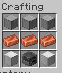

## Get Dimensional Crystals by using Netherite Forge

3 Forges and maybe more later like Dimensional Forge
* Basic Forge
* Forge
* Netherite Forge

Forge and Netherite Forge will be multiblocks

Basic Forge will be a 3 block multiblock containing:
* Heater for softening the materials
* Smithing station uses hammers
* Cooling station

Heating Station will compose of these materials to craft it

* Blast Furnace
* Copper Ingots
* Smooth Stone
* Iron Blocks

The Forge and Netherite Forge will have parts that wear down over time, and will wear down more depending on the items made
